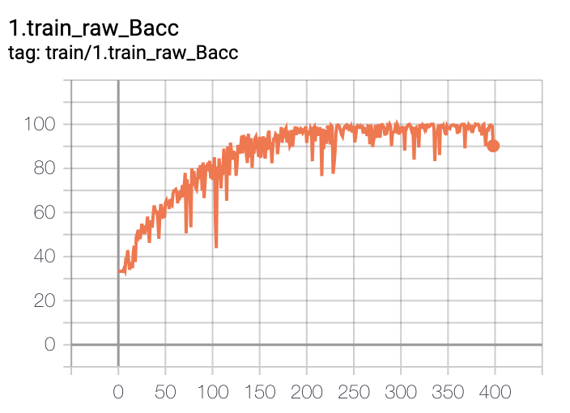
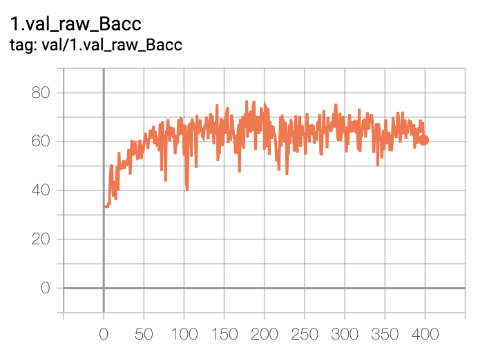
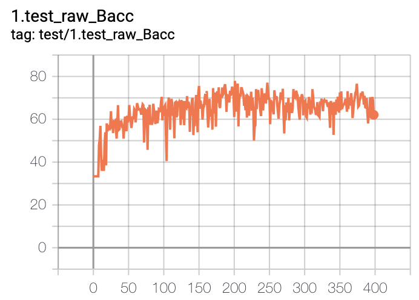

# SAMIL
Code for the paper Detecting Heart Disease from Multi-View Ultrasound Images via Supervised Attention Multiple Instance Learning (MLHC'23)

# Setup
### Prepare datasets
The AS diagnosis task in this study uses the view_and_diagnosis_labeled_set from TMED2 
- Step1. Download TMED2, please visit https://TMED.cs.tufts.edu and follow the instruction.
- Step2. Put the labeled and unlabeled image for the same study under same folder

### Install Anaconda
Follow the instructions here: https://conda.io/projects/conda/en/latest/user-guide/install/index.html

### Environment
pytorch 1.11.0

# Running experiments
### Define the environment variable
```export ROOT_DIR="paths to this repo" ```
(e.g.,  '/ab/cd/SAMIL')

```export DATA_INFO_DIR="path to the data_info/ folder" ```
(e.g.,  '/ab/cd/SAMIL/data_info')

```export DATA_DIR="path to the actual data ```
(e.g.,  '/ab/cd/SAMIL/Echo_data/view_and_diagnosis_labeled_set/')

```export CHECKPOINT_DIR="path to where pretrained view classifier and MOCO pretrained weights```
(e.g.,  '/ab/cd/SAMIL/model_checkpoints/')

We releases the pretrained view classifiers and MOCO pretrained checkpoints and the traning curves of SAMIL (retrained, for your reference) [here](https://tufts.box.com/s/c5w8123j7h3dpls75jye1363uh8qv8us). 
You can montior the training using tensorborad, and are expected to see training curves like this:

<p float="left">
  
  
  
</p>

### Hyperparameters
Please see [Hyperparameters/](Hyperparameters) for reference. You can also tried searching hyperparameter yourself.

### Example
Running SAMIL with study-level pretraining, go to [runs/SAMIL](runs/SAMIL)
``` bash launch_experiment.sh run_here ```


### A note on reproducibility
While the focus of our paper is reproducibility, ultimately exact comparison to the results in our paper will be conflated by subtle differences such as the version of Pytorch etc (see https://pytorch.org/docs/stable/notes/randomness.html for more detail).

From our experiment, we notice that there might be a few percentage variation from run to run. This is especially the case for Split1. Split0 and Split2 has less varation. (Possibly due to training signals in MIL are noisy. Another possiblity is that small validation set size might caused the selection of checkpoint at maximum validation performance not always correspond to good test performance.)

## Citing this work
@article{huang2023detecting,
  title={Detecting Heart Disease from Multi-View Ultrasound Images via Supervised Attention Multiple Instance Learning},
  author={Huang, Zhe and Wessler, Benjamin S and Hughes, Michael C},
  journal={arXiv preprint arXiv:2306.00003},
  year={2023}
}
